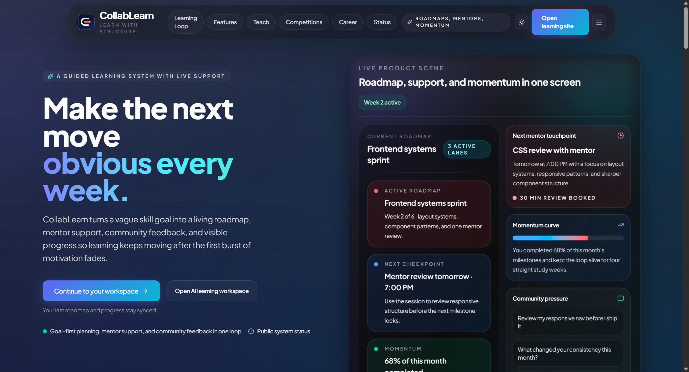
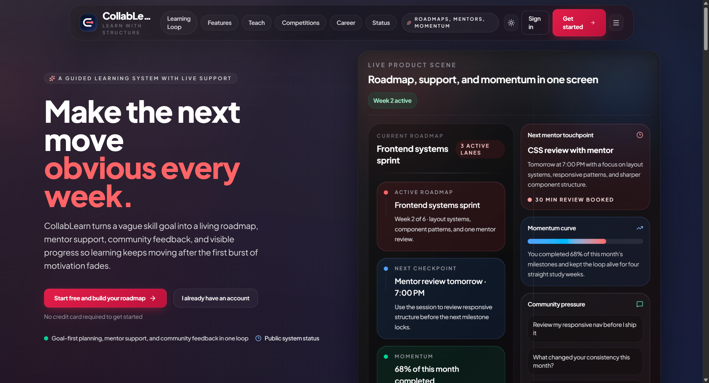
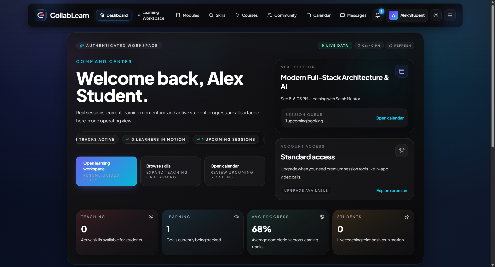
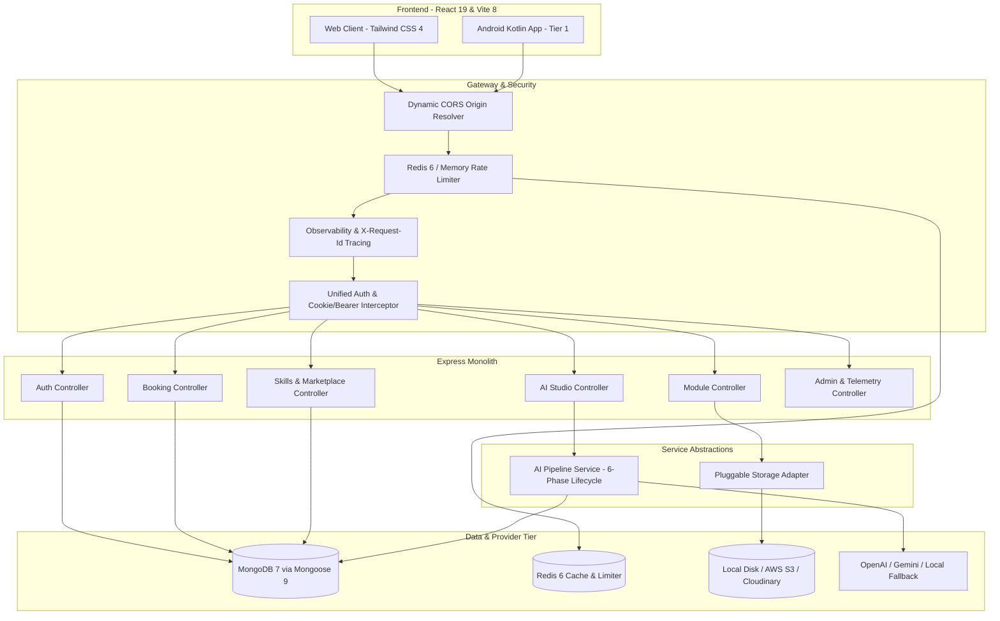

# 🚀 CollabLearn

<div align="center">



**Next-Generation Collaborative Learning & AI Skill Acceleration Platform**

[](https://nodejs.org/)
[](https://react.dev/)
[](https://vitejs.dev/)
[](https://tailwindcss.com/)
[](https://mongoosejs.com/)
[](https://mongodb.com/)
[](https://redis.io/)
[](https://nodejs.org/api/test.html)
[](./LICENSE)

[🌐 Live Production Website](https://client-dun-ten-53.vercel.app/) • [📖 OpenAPI 3.1 Spec](docs/api/openapi.yaml) • [📱 Mobile Architecture Guide](docs/mobile/MOBILE_SUPPORT.md) • [⚡ Upgrade Roadmap](docs/upgrades/major-dependency-upgrades.md)

</div>

---

## 📌 Table of Contents

- [Overview](#-overview)
- [Visual Tour & Screenshots](#-visual-tour--screenshots)
- [Monorepo Architecture](#-monorepo-architecture)
- [Core Features & User Journeys](#-core-features--user-journeys)
- [Engineering Architecture](#-engineering-architecture)
- [Technology Stack](#-technology-stack)
- [Local Development Setup](#-local-development-setup)
- [Deterministic Demo Data](#-deterministic-demo-data)
- [Testing & Quality Gates](#-testing--quality-gates)
- [API Contract & Endpoints](#-api-contract--endpoints)
- [Production Deployment](#-production-deployment)
- [Security & Production Hardening](#-security--production-hardening)
- [License](#-license)

---

## 🌟 Overview

**CollabLearn** is a full-stack skill acceleration platform that bridges self-paced learning with live peer mentorship and generative AI. Built for global learners, mentors, and teams, CollabLearn delivers:

1. **AI-Driven Learning Roadmaps**: Instant, personalized, multi-week study paths tailored to skill level, weekly available hours, and targeted goals.
2. **Context-Aware AI Mentorship**: Embedded interactive AI mentor chat equipped with intelligent multi-provider fallback (OpenAI, Google Gemini, and Local Inference Engines).
3. **Peer-to-Peer Skill Marketplace**: Direct 1-on-1 session discovery, schedule negotiation, and booking with real-time calendar synchronization.
4. **Collaborative Learning Hub**: Interactive rich-text & pretext module viewer, community discussion feed with real-time messaging, and learner momentum tracking.
5. **Multi-Platform Support**: Modern React 19 web experience backed by an official native Kotlin Android companion app (**Tier 1**), experimental Swift iOS companion (**Tier 2**), and OpenAPI 3.1 schema synchronization.

---

## 📸 Visual Tour & Screenshots

### 1. Cyber-Luminescent Landing Experience

_Hero section with real-time platform statistics, dynamic CTA buttons, and ambient glow navigation._


---

### 2. AI Learning Studio & Personalized Roadmaps

_Personalized skill roadmap builder featuring milestone tracking, focus area curation, studio tools (Quiz, Mind Maps, Flashcards, Slide Decks), and live AI provider status._


---

### 3. Learner Command Center (Dashboard)

_Comprehensive workspace showing active learning tracks, progress percentages, session queues, and one-click access to mentorship tools._


---

### 4. Admin Intelligence & Moderation Console

_Real-time platform analytics, user distribution metrics, registration velocity charts, and protected administrative controls._


---

### 5. Unified Authentication Portal

_Seamless dual-role authentication supporting student/instructor onboarding, demo account quick-fill, and Google OAuth 2.0 integration._


---

## 🏗 Monorepo Architecture

The repository is organized into distinct, modular subsystems:

```
CollabLearn/
├── client/                     # React 19 + Vite 8 Web Application
│   ├── src/
│   │   ├── components/         # Atomic UI, Navbars, AI Mentor Chat, Modals
│   │   ├── pages/              # Dashboard, AI Studio, Marketplace, Community, Admin
│   │   ├── services/           # Axios HTTP client, API wrappers
│   │   └── utils/              # State helpers, session storage, formatters
│   ├── package.json
│   └── vite.config.js          # Vite 8 build pipeline with Tailwind CSS 4
│
├── server/                     # Node.js & Express Monolithic API
│   ├── src/
│   │   ├── config/             # Database, unified auth contract, CORS
│   │   ├── controllers/        # Auth, AI Studio, Bookings, Modules, Skills
│   │   ├── middleware/         # Auth, requireAdmin, rateLimiter, observability
│   │   ├── models/             # Mongoose 9 models (User, Skill, Booking, LearningPlan)
│   │   ├── routes/             # RESTful API route definitions
│   │   └── services/           # Isolated AI Pipeline & Pluggable Storage Adapter
│   ├── scripts/                # Database ping, mock seeder, deep API smoke tests
│   └── test/                   # Comprehensive Node.js native test suite
│
├── android/                    # Tier 1 Production-Supported Kotlin Companion App
│   ├── app/src/main/           # Material 3 UI, Retrofit API client, ViewBinding
│   └── build.gradle.kts        # Gradle 9 + Kotlin DSL
│
├── ios/                        # Tier 2 Experimental Swift Companion App
│   └── CollabLearn/            # Native UIKit / URLSession prototype
│
├── flutter_app/                # Tier 3 Archived Mobile Prototype (Reference only)
│
├── docs/                       # Living Architecture Documentation
│   ├── api/                    # OpenAPI 3.1 Specification (openapi.yaml)
│   ├── mobile/                 # Mobile Platform Support Tiering Guide
│   ├── screenshots/            # High-resolution production UI captures
│   └── upgrades/               # Major dependency roadmap & migration records
│
├── shared/                     # Shared Schemas & Constants across clients
├── package.json                # Monorepo root scripts & Concurrently 10 orchestration
└── vercel.json                 # Monorepo deployment routing & SPA rewrite proxy
```

### Mobile Support Tiers

| Platform    | Directory      | Support Tier              | Tech Stack                              | Status                     |
| ----------- | -------------- | ------------------------- | --------------------------------------- | -------------------------- |
| **Web**     | `client/`      | **Primary**               | React 19, Vite 8, Tailwind 4            | 🟢 Production Active       |
| **Android** | `android/`     | **Tier 1 (Supported)**    | Kotlin, Retrofit, Material 3, API 24–34 | 🟢 Active (Gradle Built)   |
| **iOS**     | `ios/`         | **Tier 2 (Experimental)** | Swift, UIKit, URLSession                | 🟡 Experimental            |
| **Flutter** | `flutter_app/` | **Tier 3 (Archived)**     | Dart / Flutter                          | ⚪ Preserved for Reference |

_For complete mobile runtime specifications, see [`docs/mobile/MOBILE_SUPPORT.md`](./docs/mobile/MOBILE_SUPPORT.md)._

---

## ⚡ Core Features & User Journeys

### 🧠 1. AI Roadmap Studio & Skill Acceleration

- **Intelligent Curriculum Generation**: Input any target skill (e.g., _Full-Stack Systems, Deep Learning, UI Design_), experience level (_Beginner, Intermediate, Advanced_), weekly study hours, and target duration.
- **Milestone & Progress Tracking**: Real-time completion percentages persisted directly to MongoDB (`LearningPlan` model).
- **Learning Studio Accelerators**: One-click generation of interactive learning artifacts:
  - 🎙️ _Audio Overviews_
  - 📊 _Slide Decks & Infographics_
  - 🧠 _Concept Mind Maps_
  - 📝 _Study Notes & Flashcard Decks_
  - ❓ _Formative Self-Assessment Quizzes_

### 💬 2. Context-Aware AI Learning Mentor

- Slide-out drawer accessible from any page.
- Contextually aware of the user's active roadmap, current milestone, and study velocity.
- Multi-provider fallback: Uses **OpenAI GPT**, **Google Gemini**, or **Local Basic Inference Engine** seamlessly when API keys are absent or rate-limited.

### 🤝 3. 1-on-1 Mentorship & Skill Marketplace

- **Search & Signal Board**: Browse verified instructors, filter by category (_Programming, Design, Marketing_), rating, or hourly rate.
- **Frictionless Booking Modal**: Interactive date/time slot selection, duration picker (30/45/60/90 mins), estimated price calculation, and pre-built session objective templates.
- **Calendar Management**: Interactive monthly calendar with session queue, booking request approvals, and weekly hour summaries.

### 📚 4. Collaborative Modules & Pretext Reader

- Browse community-contributed educational modules.
- Embedded support for rich text and external interactive pretext lesson URLs.
- Instructor authoring interface with content sanitization and validation.

### 🌐 5. Community Hub & Discussions

- Real-time discussion threads categorized by topic (_React, Python, Career Growth_).
- Tag-based discovery (`#announcement`, `#platform`, `#release`).
- Top contributor leaderboards and engagement tracking.

### 🛡️ 6. Enterprise Admin Console

- Comprehensive administrative dashboard with system telemetry.
- User management with role overrides (`user`, `instructor`, `admin`, `super-admin`).
- Active platform telemetry with database health and live AI provider checks.

---

## 🏛 Engineering Architecture



### Key Architectural Implementations

1. **Unified Authentication Contract ([`server/src/config/auth.js`](<file:///c:/Users/shaha/OneDrive/Desktop/New%20folder%20(2)/CollabLearn/server/src/config/auth.js>))**:
   - Dual-token delivery: Issues secure `httpOnly` cookies for modern web browsers while returning Bearer tokens for mobile clients and API consumers.
   - Centralized authorization helpers: `hasRole()`, `isAdminRole()`, and `buildSessionUserPayload()`.
   - Dynamic CORS validation with support for bare hostnames and local development ports.

2. **Isolated AI Orchestration Pipeline ([`server/src/services/aiPipelineService.js`](<file:///c:/Users/shaha/OneDrive/Desktop/New%20folder%20(2)/CollabLearn/server/src/services/aiPipelineService.js>))**:
   - Executes across 6 deterministic phases:
     1. `validateInput`: Validates bounds, numeric types, and constraints.
     2. `buildPrompt`: Compiles structured JSON instruction prompts.
     3. `executeProviderWithRetry`: Primary provider execution with exponential backoff.
     4. `validateStructuredOutput`: Strips code fences and validates JSON conformity.
     5. `normalizeResponse`: Standardizes milestones, video links, and tasks.
     6. `persistResult`: Upserts verified plans in MongoDB.

3. **Pluggable Multi-Cloud Storage ([`server/src/services/storageService.js`](<file:///c:/Users/shaha/OneDrive/Desktop/New%20folder%20(2)/CollabLearn/server/src/services/storageService.js>))**:
   - Automatically activates **AWS S3 / S3-compatible** storage when `AWS_S3_BUCKET` is present.
   - Automatically activates **Cloudinary** when `CLOUDINARY_URL` is configured.
   - Gracefully falls back to local disk (`server/uploads/` or `/tmp` in serverless) with zero configuration.

4. **Structured Observability & Telemetry ([`server/src/middleware/observability.js`](<file:///c:/Users/shaha/OneDrive/Desktop/New%20folder%20(2)/CollabLearn/server/src/middleware/observability.js>))**:
   - Automatic `X-Request-Id` generation and propagation.
   - Structured JSON logging with route latency histograms, status codes, and user context.
   - Real-time system readiness inspector (`/api/health`) reporting MongoDB and AI engine state.

5. **Shared OpenAPI 3.1 Contract ([`docs/api/openapi.yaml`](<file:///c:/Users/shaha/OneDrive/Desktop/New%20folder%20(2)/CollabLearn/docs/api/openapi.yaml>))**:
   - Complete machine-readable specification preventing drift between the web application, backend routes, and mobile clients.

---

## 💻 Technology Stack

### Frontend Application

- **Core**: [React 19.2.8](https://react.dev/)
- **Build Engine**: [Vite 8.2.2](https://vitejs.dev/) with [@vitejs/plugin-react 6.1.1](https://github.com/vitejs/vite-plugin-react)
- **Styling**: [Tailwind CSS 4.3.3](https://tailwindcss.com/) & Vanilla Glassmorphic CSS Design System
- **Routing**: [React Router 7.18.3](https://reactrouter.com/)
- **Icons**: [Lucide React](https://lucide.dev/)
- **Rich Text**: [react-quill-new 3.8.3](https://github.com/imlinus/react-quill-new)
- **WebRTC Audio/Video**: [zego-express-engine-webrtc 3.12.0](https://www.zegocloud.com/)
- **Payments**: [@google-pay/button-react 4.1.0](https://developers.google.com/pay)

### Backend API

- **Runtime**: [Node.js >= 20.0.0](https://nodejs.org/)
- **Server Framework**: [Express 4.21.2](https://expressjs.com/)
- **Database & ODM**: [MongoDB 7.6.0](https://www.mongodb.com/) via [Mongoose 9.9.5](https://mongoosejs.com/)
- **In-Memory Cache**: [Redis 6.2.1](https://redis.io/) (with automatic fallback to in-memory store)
- **AI Integrations**: [OpenAI 7.10.0](https://github.com/openai/openai-node), [Google Auth Library 11.0.2](https://github.com/googleapis/google-auth-library-nodejs)
- **Security**: [Helmet 8.3.0](https://helmetjs.github.io/), [CORS 2.8.6](https://github.com/expressjs/cors), [Dotenv 17.4.2](https://github.com/motdotla/dotenv)
- **File Uploads**: [Multer 2.3.0](https://github.com/expressjs/multer)

### Mobile & Native Tooling

- **Android**: Kotlin 2.2, Android Gradle Plugin 8.x, Gradle 9.3.1, Retrofit 2, Material 3
- **iOS**: Swift 5.x, UIKit, URLSession
- **Linting & Formatting**: [ESLint 10.10.0](https://eslint.org/) (Flat Config), [Prettier 3.9.6](https://prettier.io/), [lint-staged 17.5.0](https://github.com/lint-staged/lint-staged)
- **Task Orchestration**: [Concurrently 10.0.5](https://github.com/open-cli-tools/concurrently)

---

## 🛠 Local Development Setup

### Prerequisites

- **Node.js**: `v20.0.0` or higher (verified with `.nvmrc`)
- **npm**: `v10.0.0` or higher
- **MongoDB**: Local MongoDB instance running on `mongodb://127.0.0.1:27017` or a MongoDB Atlas URI

### 1. Clone & Configure Environment Variables

```bash
git clone https://github.com/Aadishah17/CollabLearn.git
cd CollabLearn

# Copy environment variable templates
cp .env.example .env
cp server/.env.example server/.env
cp client/.env.example client/.env
```

### 2. Install Monorepo Dependencies

```bash
# Installs dependencies across root, server, and client concurrently
npm run setup
```

### 3. Seed Deterministic Mock Data

```bash
npm run seed:mock --prefix server
```

### 4. Start Development Servers

```bash
npm run dev
```

- **Web Client**: [http://localhost:5173](http://localhost:5173)
- **API Server**: [http://localhost:5001](http://localhost:5001)

---

## 👤 Deterministic Demo Data

Running `npm run seed:mock --prefix server` seeds the database with full demonstration data:

| Account Role    | Email                      | Password                | Pre-configured Data                                                       |
| --------------- | -------------------------- | ----------------------- | ------------------------------------------------------------------------- |
| **Learner**     | `noah.learner@example.com` | `DemoPass123!`          | Active roadmap ("JavaScript Testing & Reliability", 34% complete), 1 goal |
| **Instructor**  | `sarah.mentor@example.com` | `DemoPass123!`          | Active skill ("Modern Full-Stack Architecture & AI", 5.0 rating, free)    |
| **Super Admin** | `shahaadi285@gmail.com`    | `SuperSecureAdmin2026!` | Global moderation privileges, analytics access, telemetry views           |

_Note: In non-production environments, if an admin password does not match, the system securely checks matching local credentials._

---

## 🧪 Testing & Quality Gates

The repository enforces strict continuous integration quality gates. Every test, lint rule, and build step runs locally and in CI:

```bash
# 1. Run full unit and integration test suite (108 tests)
npm run test

# 2. Run client ESLint 10 checks
npm run lint

# 3. Verify Prettier formatting across the monorepo
npm run format:check

# 4. Build Vite 8 production client bundle
npm run build

# 5. Run production security dependency audit (0 vulnerabilities)
npm run audit

# 6. Run deep API smoke tests against running server
node server/scripts/deep-api-smoke.js

# 7. Test Android native debug APK build
cd android && .\gradlew.bat assembleDebug
```

### Test Suite Summary

- **Server Test Suite**: **67 passing** (`server/test/*.cjs`) covering auth, cookies, rate limiting, Mongoose 9 hooks, storage providers, AI pipeline lifecycle, and observability.
- **Client Test Suite**: **41 passing** (`client/src/**/*.test.js`) covering session helpers, roadmaps, module viewers, navigation security, and recommendation algorithms.
- **Total Tests**: **108 passing**, 0 failing.

---

## 📡 API Contract & Endpoints

All endpoints are documented in [`docs/api/openapi.yaml`](docs/api/openapi.yaml). Below is an overview of core endpoints:

### Authentication & User Sessions

| Method | Endpoint             | Description                                     | Auth Required   |
| ------ | -------------------- | ----------------------------------------------- | --------------- |
| `POST` | `/api/auth/register` | Register new user; issues cookie + Bearer token | None            |
| `POST` | `/api/auth/login`    | Authenticate user; issues cookie + Bearer token | None            |
| `POST` | `/api/auth/logout`   | Clear HTTP-only session cookie                  | None            |
| `GET`  | `/api/auth/me`       | Fetch authenticated user session profile        | Bearer / Cookie |
| `POST` | `/api/auth/google`   | Google OAuth 2.0 credential verification        | None            |

### AI Learning Studio & Roadmaps

| Method  | Endpoint                         | Description                                      | Auth Required   |
| ------- | -------------------------------- | ------------------------------------------------ | --------------- |
| `POST`  | `/api/ai/roadmap`                | Generate structured multi-week skill roadmap     | Bearer / Cookie |
| `POST`  | `/api/ai/chat`                   | Interactive AI mentor conversation               | Bearer / Cookie |
| `POST`  | `/api/ai/study-session`          | Generate targeted study sprint from active plan  | Bearer / Cookie |
| `GET`   | `/api/ai/plans`                  | List saved learning plans for authenticated user | Bearer / Cookie |
| `PATCH` | `/api/ai/plans/:planId/progress` | Update milestone completion percentage           | Bearer / Cookie |
| `GET`   | `/api/ai/studio-status`          | Report active AI provider and model diagnostics  | None            |

### Mentorship & Bookings

| Method  | Endpoint                  | Description                                               | Auth Required       |
| ------- | ------------------------- | --------------------------------------------------------- | ------------------- |
| `GET`   | `/api/skills`             | Browse skill marketplace listings                         | None                |
| `POST`  | `/api/skills`             | Create a new teaching listing                             | Instructor / Admin  |
| `POST`  | `/api/booking`            | Create 1-on-1 session booking request                     | Bearer / Cookie     |
| `GET`   | `/api/booking/user`       | Get bookings for authenticated user (learning & teaching) | Bearer / Cookie     |
| `PATCH` | `/api/booking/:id/status` | Confirm or cancel booking request                         | Participant / Admin |

### System Telemetry & Health

| Method | Endpoint             | Description                                            | Auth Required |
| ------ | -------------------- | ------------------------------------------------------ | ------------- |
| `GET`  | `/api/health`        | Healthcheck, MongoDB readiness, uptime, and request ID | None          |
| `GET`  | `/api/admin/metrics` | User growth, active listings, and platform statistics  | Admin only    |

---

## 🚀 Production Deployment

### Vercel (Recommended for Web Frontend)

The repository includes root-level [`vercel.json`](./vercel.json) configured for monorepo deployments:

1. Connect your GitHub repository to Vercel.
2. Select repository root as the project root (no custom directory required).
3. The build configuration automatically executes:
   - **Install Command**: `npm install --prefix client`
   - **Build Command**: `npm run build --prefix client`
   - **Output Directory**: `client/dist`
4. Set `VITE_API_URL` to your production backend URL.

### Render (Full-Stack Blueprint)

A complete [`render.yaml`](./render.yaml) blueprint is provided to orchestrate both services:

- **`collablearn-web`**: Static site hosting the React 19 frontend.
- **`collablearn-api`**: Node.js/Express web service running the backend API.

Required environment secrets in Render:

```
MONGODB_URI=<your-mongodb-atlas-connection-string>
JWT_SECRET=<secure-random-64-character-secret>
```

---

## 🔒 Security & Production Hardening

- **JWT Secret Validation**: The API validates that `JWT_SECRET` is strong and explicitly rejects default placeholders.
- **Strict Cookie Security**: The `httpOnly` authentication cookie supports `SameSite=Lax` (or `None` in cross-site setups) with `secure: true` automatically enabled in production.
- **Dynamic CORS Origin Sanitization**: `CORS_ORIGINS` automatically handles protocol normalization, stripping trailing slashes, and blocking unauthorized third-party origins.
- **Fallback Rate Limiting**: Distributed rate limiting powered by Redis 6, automatically degrading to thread-safe local counters if Redis is offline.
- **Reverse Proxy Support**: Configured with `TRUST_PROXY=1` support for proper client IP resolution behind Cloudflare, Vercel, and Render.

---

## 📄 License

This project is licensed under the [ISC License](./LICENSE).

---

<div align="center">
<b>Built with passion by the CollabLearn Team</b><br>
<i>Empowering global learners through collaborative acceleration and generative AI.</i>
</div>
